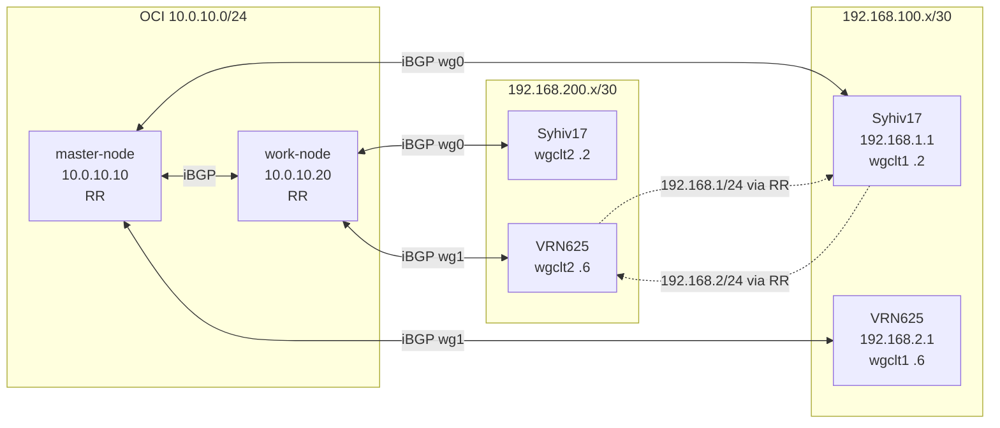

# Діаграма маршрутизації BGP (Syhiv / Amper mesh)

Поточна схема динамічної маршрутизації після переходу з OSPF на BGP. Чотири вузли, WireGuard full-mesh між Amper і двома UCG, iBGP AS 65001, Route Reflector на master і worker.

---

## 1. Топологія BGP-сесій

```
                    ┌─────────────────────────────────────────────────────────┐
                    │                    AS 65001 (iBGP)                       │
                    └─────────────────────────────────────────────────────────┘

     OCI 10.0.10.0/24 (enp0s6)
     ┌──────────────────────────────────────┐
     │   master-node          work-node     │
     │   10.0.10.10           10.0.10.20    │
     │   RR cluster 0.0.0.1    RR cluster   │
     └───────────┬────────────────┬─────────┘
                 │                │
        wg0      │                │      wg0
    192.168.100.1│                │192.168.200.1
                 │                │
     ┌───────────▼──────┐   ┌─────▼──────────┐
     │ wg1 192.168.100.5│   │wg1 192.168.200.5│
     └───────┬─────────┘   └─────┬──────────┘
             │                    │
   192.168.100.0/30      192.168.200.0/30
             │                    │
     ┌───────▼────────┐   ┌──────▼─────────┐
     │    Syhiv17      │   │    VRN625      │
     │  192.168.1.1    │   │  192.168.2.1   │
     │  wgclt1 .2      │   │  wgclt1 .6     │
     │  wgclt2 .2      │   │  wgclt2 .6     │
     │  192.168.1.0/24 │   │  192.168.2.0/24 │
     └─────────────────┘   └─────────────────┘
             │                    │
   192.168.100.4/30       192.168.200.4/30
             │                    │
             └──────────┬─────────┘
                        │
                  (немає прямого
                   BGP peer між
                   Syhiv17 ↔ VRN625;
                   маршрути через RR)
```

---

## 2. Таблиця вузлів і BGP-сусідів

| Вузол | Router ID | Роль | BGP neighbors | Інтерфейси (адреси) |
|-------|-----------|------|----------------|----------------------|
| **master-node** | 10.0.10.10 | k3s master, **Route Reflector** | 10.0.10.20, 192.168.100.2 (Syhiv17), 192.168.100.6 (VRN625) | enp0s6 10.0.10.10, wg0 192.168.100.1, wg1 192.168.100.5 |
| **work-node** | 10.0.10.20 | k3s worker, **Route Reflector** | 10.0.10.10, 192.168.200.2 (Syhiv17), 192.168.200.6 (VRN625) | enp0s6 10.0.10.20, wg0 192.168.200.1, wg1 192.168.200.5 |
| **Syhiv17** (UCG) | 192.168.1.1 | роутер | 192.168.100.1 (master), 192.168.200.1 (worker) | br0 192.168.1.1, wgclt1 192.168.100.2, wgclt2 192.168.200.2 |
| **VRN625** (UCG) | 192.168.2.1 | роутер | 192.168.100.5 (master), 192.168.200.5 (worker) | br0 192.168.2.1, wgclt1 192.168.100.6, wgclt2 192.168.200.6 |

---

## 3. Підмережі WireGuard (/30)

| Підмережа | Сторона A | Сторона B |
|-----------|-----------|------------|
| 192.168.100.0/30 | master wg0 .1 | Syhiv17 wgclt1 .2 |
| 192.168.100.4/30 | master wg1 .5 | VRN625 wgclt1 .6 |
| 192.168.200.0/30 | worker wg0 .1 | Syhiv17 wgclt2 .2 |
| 192.168.200.4/30 | worker wg1 .5 | VRN625 wgclt2 .6 |

Між Syhiv17 і VRN625 **немає прямого тунеля**; обмін маршрутами 192.168.1.0/24 та 192.168.2.0/24 — через Route Reflector (master і worker).

---

## 4. Оголошені в BGP мережі (по вузлах)

| Вузол | Оголошені префікси |
|-------|--------------------|
| master | 10.0.10.10/32, 10.0.10.0/24, 192.168.100.0/30, 192.168.100.4/30 |
| worker | 10.0.10.20/32, 10.0.10.0/24, 192.168.200.0/30, 192.168.200.4/30 |
| Syhiv17 | 192.168.1.0/24, 192.168.100.0/30, 192.168.200.0/30 |
| VRN625 | 192.168.2.0/24, 192.168.100.4/30, 192.168.200.4/30 |

Після відображення через RR на кожному UCG з’являються також 192.168.1.0/24 та 192.168.2.0/24 (з next-hop через master або worker за local-preference).

---

## 5. Політики на UCG (симетричний шлях)

- **FROM-MASTER** (local-preference 200): маршрути від master — переважні → трафік до 10.0.10.10 та 192.168.100.x через **wgclt1**.
- **FROM-WORKER** (local-preference 100): маршрути від worker — резерв → трафік до 10.0.10.20 та 192.168.200.x через **wgclt2**.

Це уникає асиметричного reply та дропу через conntrack/firewall.

---

## 6. Діаграма (Mermaid)



(Пунктир: маршрути 192.168.1.0/24 та 192.168.2.0/24 йдуть через master/worker як Route Reflector, не прямим peer.)

---

## 7. Посилання

| Документ | Опис |
|----------|------|
| **manifests/bgp-configs/README.md** | Конфіги, розгортання, Route Reflector, firewall |
| **OSPF_TO_BGP_MIGRATION_COMPLETED.md** | Фіксація виконаного переходу OSPF → BGP |
| **OSPF_VS_BGP_FOUR_ROUTERS_MESH.md** | Обґрунтування переходу на BGP |
| **Syhiv OSPF.pdf** | Попередня діаграма OSPF (історична) |
| **WIREGUARD_CORRECT_TOPOLOGY.md** | Топологія WireGuard, підмережі /30 |
